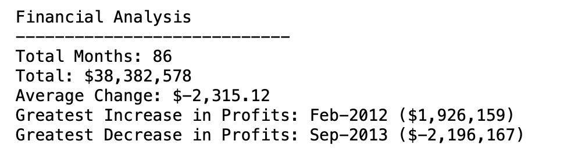

# Analyzing Financial Records

[Financial_script](https://github.com/MabelAlamu/financial_records/blob/main/financial_script.ipynb) contains code that analyzes the financial records of a fictional company. The financial data, [budget_data.csv](https://github.com/MabelAlamu/financial_records/blob/main/budget_data.csv) is composed of two columns 'Date' and 'Profit/Losses'. 

The financial_script calculates the following and saves the output as a csv file:

 *The total number of months included in the dataset
  
*The net total amount of "Profit/Losses" over the entire period
  
*Calculate the changes in "Profit/Losses" over the entire period, then find the average of those changes
  
*The greatest increase in profits (date and amount) over the entire period
  
*The greatest decrease in losses (date and amount) over the entire period
 
 Output:
  
